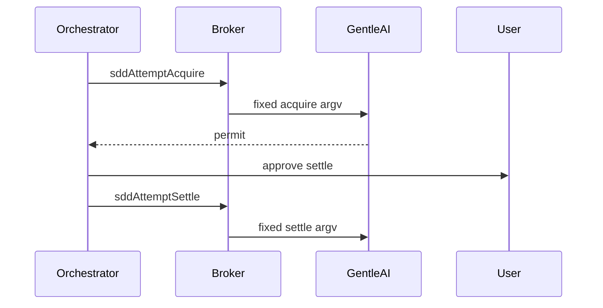
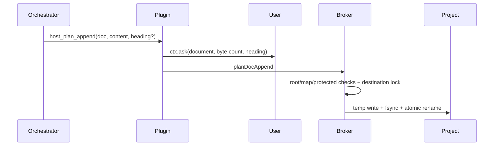
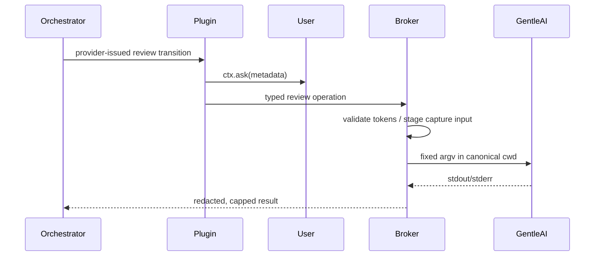

# Design: Agent Host Tools

## Technical Approach

Add one fixed-argv broker operation and `host_*` tool per P0 command (T1). Reuse `SddRuntimeExecutor.resolveProjectRoot`, `assertExactKeys`, direct spawning, strict JSON, and bounded output. Token-bound review mutations remain absent.
Add `sddAttemptRescope` through the same typed operation, validation, executor, service, dispatch, plugin, approval, and permission pipeline; the broker forwards only a validated fixed argv vector and leaves objective-cap ceilings and narrower-successor enforcement to the CLI.
Add `sddAttemptBegin` through that mutation pipeline and `sddAttemptStatus` through the tolerant read pipeline used by `reviewModeStatus`; begin activates the ledger's existing objective, while status observes it without mutation.
Add `sddAttemptFinish`, `sddAttemptReset`, and `sddAttemptGrant` through the same per-operation mutation pipeline. The broker validates shape and canonical paths, emits fixed argv, and leaves revision/state-transition policy to the CLI.

## Architecture Decisions

| Decision | Choice and rationale |
|---|---|
| Topology | Per-command operations preserve per-tool authority and auditability; reject generic dispatch (§9/§14). |
| Commit | S1 uses persisted `baselineRef`→`resultRef`; reject `git add -A`, clean-tree, and commit-during-apply because they sweep work or couple concerns. |
| Authority | Broker `HostToolPolicy` uses its trusted session→agent registry; envelope `agent` remains logging-only and sandbox-only `assertNotOrchestrator` is not reused. |
| Approval | Mutations use fragment `ask` plus metadata-rich `ctx.ask`; reads use `allow` without prompts, matching `sandbox_apply`. |
| Finish semantics | Complete the ACTIVE attempt without a token. Require and forward CAS `expectedRevision`; the CLI compares it with the current runtime revision. |
| Reset semantics | Keep restart authority separate: `reset` is the only operation that may restart a `decision_required` or `complete` objective. |
| Grant semantics | Treat grant as runtime-owned, idempotent-ish state mutation: an initial grant may omit CAS, later grants carry it; the broker does not synthesize revision or state. |

Mutations `registerProject`, `sddAttemptAcquire`, `sddAttemptSettle`, `sddAttemptRescope`, `sddAttemptBegin`, `sddArchiveCompose`, `gitCommit`, `gitPush`, `ghIssueCreate` are `gentle-orchestrator`-only. Reads `sddStatus`, `sddContinue`, `sddAttemptStatus`, `sddVerifyValidate`, `sddTaskResult`, `reviewAssess`, `reviewModeStatus`, `reviewStatus` are open to all agents and never prompt. Plugin checks mirror broker policy only as defense in depth.

`sddAttemptFinish`, `sddAttemptReset`, and `sddAttemptGrant` join the orchestrator-only mutation list. Expose them as `host_sdd_attempt_finish`, `host_sdd_attempt_reset`, and `host_sdd_attempt_grant`; each uses metadata-rich `ctx.ask` and fragment permission `ask`.

## Interfaces / Contracts

Every payload includes broker-derived `projectDir` and rejects extra keys.

- `sddStatus {change?,contract?}` → `gentle-ai sdd-status [change] --cwd <root> --json --instructions [--contract gentle-ai.sdd-status/v2]`.
- `sddContinue {change?}` → `gentle-ai sdd-continue [change] --cwd <root>`; `--json` remains unverified and is not part of the frozen template.
- `sddAttemptAcquire {change,requestId,workUnit,evidenceGoal,maxAttempts,maxChangedLines,untrackedScope?,expectedUntrackedInventory?,intendedUntracked?}` → `gentle-ai sdd-attempt acquire --cwd <root> --change <change> --request-id <id> --work-unit <unit> --evidence-goal <goal> --max-attempts <n> --max-changed-lines <n>` plus, when declared, `--untracked-scope <exclude|select> --expected-untracked-inventory <sha256:64-hex>` and one `--intended-untracked <repo-relative-path>` per path. `untrackedScope` and `expectedUntrackedInventory` MUST be supplied together; `select` requires at least one `intendedUntracked`; `exclude` forbids them; intended paths are canonicalized beneath the project root.
- `sddAttemptRescope {change,expectedRevision,requestId,workUnit,evidenceGoal,maxAttempts,maxChangedLines,reason,actor}` → `gentle-ai sdd-attempt rescope --cwd <root> --change <change> --expected-revision <sha256:64-hex> --request-id <id> --work-unit <label> --evidence-goal <goal> --max-attempts <n> --max-changed-lines <n> --reason <text> --actor <actor>`. Rescope authorizes only a narrower successor objective, with cumulative attempts and changed-line counts carried forward unchanged. The CLI refuses caps above the current objective caps (currently 3 and 800); the broker validates only positive integers and MUST NOT clamp or encode the CLI ceiling. `expectedRevision` is `sha256:` plus exactly 64 lowercase hexadecimal characters. `actor` is a bounded non-empty identifier without control characters; `reason` is 1..4096 bytes without NUL or control characters. `requestId`, `workUnit`, and `evidenceGoal` reuse the existing bounded identifier rules.
- `sddAttemptBegin {change,expectedRevision,requestId,workUnit,evidenceGoal,maxAttempts,maxChangedLines}` → `gentle-ai sdd-attempt begin --cwd <root> --change <change> --expected-revision <sha256:64-hex> --request-id <id> --work-unit <label> --evidence-goal <goal> --max-attempts <n> --max-changed-lines <n>`. Begin starts the objective already recorded by maintainer `rescope`; it does not create an objective, and cumulative attempts and changed lines carry forward. The CLI refuses caps above the current objective caps (currently 3/800), so the broker validates only positive integers and MUST NOT clamp or encode the ceiling.
- `sddAttemptStatus {change}` → `gentle-ai sdd-attempt status --cwd <root> --change <change>`. The exact installed-binary flag set is UNVERIFIED. Mirror `reviewModeStatus`: return numeric status plus raw stdout/stderr, attach parsed JSON only when parsing succeeds, and never fail solely on non-JSON. The result publishes `objective.work_unit`, `objective.evidence_goal`, `objective.max_attempts`, and `objective.max_changed_lines`.
- `sddAttemptSettle {change,requestId,token,outcome,diagnosis,harnessDisposition,cleanupEvidence,processEvidence,evidenceRevision?,untrackedScope?,expectedUntrackedInventory?,intendedUntracked?}` → `gentle-ai sdd-attempt settle --cwd <root> --change <change> --token <token> --request-id <requestId> --outcome <passed|failed|interrupted> [--evidence-revision <sha256>] --diagnosis <diagnosis> --harness-disposition <reused|invalidated> --cleanup-evidence <evidence> --process-evidence <evidence>`; `evidenceRevision` is required for `passed`/`failed` and omitted for `interrupted`. Settle carries the SAME optional untracked declaration as acquire — `--untracked-scope <exclude|select> --expected-untracked-inventory <sha256:64-hex>` and, for `select`, one `--intended-untracked <repo-relative-path>` per path — through the shared builder validation. The token is opaque acquire output, and settle `requestId` is distinct from the acquire request ID. Settle never includes acquire-only `workUnit` or `changedLines`.

| Operation and payload keys | Fixed adapter command |
|---|---|
| `sddAttemptFinish {change,expectedRevision,requestId,outcome,evidenceRevision,diagnosis,harnessDisposition,cleanupEvidence,processEvidence,remediatesEvidenceRevision?,untrackedScope?,expectedUntrackedInventory?,intendedUntracked?}` | `gentle-ai sdd-attempt finish --cwd <canonical-root> --change <change> --expected-revision <sha256:64-hex> --request-id <lowercase-id> --outcome <failed\|interrupted\|passed> --evidence-revision <sha256-or-empty> --diagnosis <text> --harness-disposition <reused\|invalidated> --cleanup-evidence <text> --process-evidence <text> [--remediates-evidence-revision <sha256>] [--untracked-scope <exclude\|select> --expected-untracked-inventory <sha256:64-hex> [--intended-untracked <repo-relative-path>...]]`. |
| `sddAttemptReset {change,expectedRevision,requestId,reason,actor,objectiveRelation?}` | `gentle-ai sdd-attempt reset --cwd <canonical-root> --change <change> --expected-revision <sha256:64-hex> --request-id <lowercase-id> --reason <text> --actor <actor> [--objective-relation <remediation\|independent>]`. |
| `sddAttemptGrant {change,expectedRevision?,roots,changeInstance,requestId,actor,reason}` | `gentle-ai sdd-attempt grant --cwd <canonical-root> --change <change> [--expected-revision <sha256:64-hex>] --root <canonical-path>... --change-instance <caller-token> --request-id <lowercase-id> --actor <actor> --reason <text>`. |

Reuse the existing SDD identifier, opaque-token/request-ID, revision, evidence-text/reason, actor, enum, and untracked-declaration validator primitives, parameterized to these tighter contracts. `expectedRevision` is `sha256:` plus 64 lowercase hex and is required for finish/reset but optional only for an initial grant. `outcome` is `failed|interrupted|passed`; `harnessDisposition` is `reused|invalidated`; `objectiveRelation` is `remediation|independent`. Finish requires a 64-lowercase-hex `evidenceRevision` for failed/passed and emits an empty (or canonical legacy) value for interrupted; `remediatesEvidenceRevision` is optional canonical evidence on both finish and settle. Finish evidence texts are 1..500 UTF-8 bytes. Reset `reason`/`actor` are 1..500/1..128 UTF-8 bytes. Grant requires 1..32 unique canonical absolute roots of at most 4096 UTF-8 bytes each and a 1..128-byte safe `changeInstance`; request IDs are lowercase safe IDs. Begin additionally accepts the shared untracked declaration. All flag values reject controls/NUL and leading `-` where specified. Finish intentionally has no token. Do not clamp or duplicate CLI-owned state/ceiling policy, matching rescope.

All three operations use the broker-resolved allowlisted project root as cwd and accept neither caller-supplied cwd, binary, nor argv. Returned stdout/stderr are redacted before each 512-KiB cap.

- `sddArchiveCompose {canonical,delta,output}` → `gentle-ai sdd-archive-compose --canonical <path> --delta <path> --output <path>`.
- `sddVerifyValidate {input,requirements,scenarios}` → `gentle-ai sdd-verify-validate --input <path|-> --requirements <n> --scenarios <n>`.
- `sddTaskResult {phase,input}` → `gentle-ai sdd-task-result --phase <phase> --cwd <root> --input <path|->`.
- `reviewAssess {}` → `gentle-ai review assess`; `--cwd` and `--json` remain unverified and are not part of the frozen template. `reviewModeStatus {}` → `gentle-ai review mode status`; `--json` remains unverified and is not part of the frozen template.
- `reviewStatus {projectDir,agent?,lineage?,repositoryContext?,projection?,intendedUntrackedSelection?}` → `gentle-ai review status --cwd <root> --contract gentle-ai.review-integration/v2 --agent <agent> [--lineage <value>] [--repository-context <value>] [--projection workspace|staged] [--intended-untracked-selection <schema-bound-json>] --next-transition`. `agent` defaults to `opencode` and MUST match `^[a-z0-9_-]{1,64}$`; `lineage` and `repositoryContext` are bounded provider tokens and `projection` is `workspace|staged`; `intendedUntrackedSelection` carries the provider's schema-bound `gentle-ai.review-intended-untracked-selection/v1` JSON text verbatim, emitted as exactly one `--intended-untracked-selection <json>` element after `--projection` and before `--next-transition` and never reshaped, re-serialized, or reordered. The broker fails closed on a non-JSON, empty, oversized (over 65536 bytes), control-bearing, or flag-like value. The raw JSON envelope is returned unchanged (the broker never reshapes it).

File paths are project-relative (or `-`) and canonicalized beneath root.

**Worked `gitCommit`:** add the operation to `Operation`/`OPERATIONS`; allow only `projectDir,message`; add handler/dispatch; expose `host_git_commit`; configure `ask`/timeout. Load B/C from the session, run `git diff --name-only --no-renames -z <B> <C> -- .`, validate and `checkProtectedPaths`, then `buildGitCommitArgv` emits `git add -- <paths>` and `git commit -m <message> -- <paths>`. Message: one `-m`, 1–4096 bytes, no leading `-` or controls. `buildGitPushArgv` broker-resolves branch/upstream/ahead count and emits only `git push [--set-upstream] <remote> <branch>`. Reject detached HEAD, absent upstream without `setUpstream`, `main`/`master` without `allowProtectedBranch`, force/lease/delete, and `+refspec` (§31). `ghIssueCreate {repo,title,body}` emits only `gh issue create --repo <repo> --title <title> --body <body>` with 256/256/65536-byte caps. Git/GH stdout/stderr are 512-KiB-capped and `redact()`ed. A pure helper builds ask metadata: commit branch/subject/path preview/protected result; push remote/branch/ahead/upstream/warning; issue repo/title/body preview.

## Data Flow

```mermaid
sequenceDiagram
Agent->>Plugin: host_git_commit(message)
Plugin->>User: ctx.ask(metadata)
Plugin->>Broker: gitCommit
Broker->>Git: derive/check B..C paths
Broker->>Git: add; commit -- paths
```



## File Changes

| Files | Action |
|---|---|
| `broker/src/{types,validation,sdd-runtime,sdd-service,service,server,gitops}.ts` | Contracts, builders, policy, handlers, registration dispatch. |
| `opencode/plugins/sandbox-tools.ts`, `opencode/plugins/lib/{broker-client,host-tool-approval}.ts`, `opencode/config-fragments/sandbox-permissions.jsonc` | Tools, timeouts, approval, permissions. |
| `docs/threat-model.md`, `broker/tests/{sdd-runtime,gitops,validation,service-host-tools}.test.ts` | Boundary documentation and tests. |
| `broker/src/{types,validation,sdd-runtime,sdd-service,service,server}.ts`, `opencode/plugins/sandbox-tools.ts`, `opencode/plugins/lib/{host-tool-approval,broker-client}.ts`, `opencode/config-fragments/sandbox-permissions.jsonc`, `broker/tests/{sdd-runtime,validation,service-host-tools}.test.ts` | Add the rescope contract, positive-only cap validation, fixed argv execution, orchestrator authorization/dispatch, approval metadata, tool/timeout/permission wiring, and focused tests. |
| `broker/src/{types,validation,sdd-runtime,sdd-service,service,server}.ts`, `opencode/plugins/sandbox-tools.ts`, `opencode/plugins/lib/{host-tool-approval,broker-client}.ts`, `opencode/config-fragments/sandbox-permissions.jsonc` | Add begin/status payload contracts and exact-key validators, argv builders/executor methods, service handlers and authorization, server dispatch, `host_sdd_attempt_begin` ask metadata, read-only `host_sdd_attempt_status`, broker-client operation names/timeouts, and `ask`/`allow` permission entries. |
| `broker/tests/{sdd-runtime,validation,service-host-tools}.test.ts` | Add focused RED coverage for begin/status argv and passthrough, validation, routing, authorization, metadata, operation registration, and permissions. |
| `broker/src/{types,validation,sdd-runtime,sdd-service,service,server}.ts`, `opencode/plugins/sandbox-tools.ts`, `opencode/plugins/lib/{host-tool-approval,broker-client}.ts`, `opencode/config-fragments/sandbox-permissions.jsonc` | Add finish/reset/grant payloads, exact-key validators, fixed argv builders/executors, orchestrator-only routing, approval metadata, timeouts, tool exposure, and `ask` permissions. |
| `docs/threat-model.md`, `broker/tests/{sdd-runtime,validation,service-host-tools}.test.ts` | Document the new process/root boundaries and add focused RED coverage. |

## Testing Strategy

Extend `sdd-runtime.test.ts` fake-spawn coverage for every vector and settle variant. Test builders/guards for caps, B..C scope, branch/upstream/§31 rejection, redaction, and pure ask metadata. Add `registerProject` service success/nonzero-spawn and validation exact-key tests. Live git/GH requires `SANDBOX_GATED_TESTS`; gates: `bun test`, `bun build src/main.ts`.
For rescope, add RED tests in `broker/tests/sdd-runtime.test.ts` for exact argv, malformed `expectedRevision`, positive cap forwarding, and CLI rejection without broker clamping; in `broker/tests/validation.test.ts` for exact payload keys, bounded/control-free `actor`, and 1..4096-byte control-free `reason`; and in `broker/tests/service-host-tools.test.ts` for `gentle-orchestrator`-only authorization and handler routing. Exercise the integration seams in `broker/src/{types,validation,sdd-runtime,sdd-service,service,server}.ts`, `opencode/plugins/sandbox-tools.ts`, `opencode/plugins/lib/{host-tool-approval,broker-client}.ts`, and `opencode/config-fragments/sandbox-permissions.jsonc` through operation registration, metadata, timeout, and permission assertions.
For begin, RED-test exact argv, malformed revision, extra fields, positive cap forwarding, CLI-owned oversized-cap refusal without broker clamping, orchestrator-only authorization, ask metadata, handler, and dispatch. For status, RED-test the candidate fixed argv, extra fields, all-agent/no-prompt authorization, raw numeric-status/stdout/stderr passthrough for JSON and non-JSON, published objective fields, and proof that the ledger is unchanged.
For finish/reset/grant, RED-test exact argv and optional-flag order, exact payload keys, required/optional CAS behavior, stale-CAS passthrough failure, enum rejection, finish outcome/evidence rules, 500/128-byte text bounds, flag-like/control rejection, token absence, reset state eligibility and obligation relation, grant initial-revision omission, 1..32 ordered unique canonical roots, duplicate/relative/noncanonical/oversized root rejection, absolute intended-untracked rejection, redaction before 512-KiB capping, authorization/dispatch, ask metadata, timeouts, operation registration, and fragment `ask` entries.

## Threat Matrix

| Boundary | Applicability | Safe/failure behavior and RED tests |
|---|---|---|
| Documentation-like paths | N/A — no executable classification | None. |
| Git repository selection | Applicable: `git -C`, relative, absolute | Use exact approved cwd; reject selectors/free-form roots; test each. |
| Commit state | Applicable: staged, `commit -a`, empty index | Ignore unrelated staging, never `-a`, reject empty B..C; test each. |
| Push state | Applicable: tracking, first push, explicit refspec | Resolve destination, require `setUpstream` for first push, reject refspec; test each. |
| PR commands | N/A — issue creation is not PR automation | None. |
| Rescope process boundary | Applicable: oversized caps and untrusted text | Forward positive `maxAttempts`/`maxChangedLines` unchanged so the CLI refuses values above current objective caps; never silently clamp. Reject empty, oversized, or control-character-bearing `actor`/`reason`; RED-test each safe and failure boundary. |
| Begin process boundary | Applicable: oversized caps | Forward positive `maxAttempts`/`maxChangedLines` unchanged; the CLI MUST refuse values above the current objective caps and the broker MUST NOT clamp or encode the ceiling. RED-test unchanged forwarding and CLI refusal. |
| Status process boundary | Applicable: ledger observation | Treat status as a read for every agent, tolerate JSON and non-JSON output, and MUST NOT mutate the ledger. RED-test unchanged ledger state and raw-envelope behavior. |
| Finish process boundary | Applicable: CAS, evidence, untracked paths, output | Fixed argv/canonical cwd only; enforce outcome/revision coupling, reject absolute `intendedUntracked`, redact before capping, and RED-test stale CAS, path escape, controls/flag-like text, and output limits. |
| Reset process boundary | Applicable: terminal-objective restart | Fixed argv/canonical cwd only; permit only CLI-authorized `decision_required`/`complete` transitions, preserve relation exactly, redact output, and RED-test invalid state, CAS, relation, and text. |
| Grant process boundary | Applicable: repeatable host roots | Accept only 1..32 unique canonical absolute roots (≤4096 bytes), preserve order as repeated `--root`, reject relative/noncanonical/duplicate roots, and expose no arbitrary cwd/binary/argv. RED-test each boundary plus redaction/capping. |

## Migration / Rollout

No migration. S17 targets require `.new` staging outside protected paths, user manual review/copy, then restart gates. Rollback stops before copy or restores prior files/reverts delivery; no persisted schema remains.

## Open Questions

- Verify against the installed `gentle-ai` binary, through the host broker, whether `sdd-continue` supports or requires `--json` before freezing that argv template.
- Verify through the host broker whether `review assess` supports or requires `--cwd` and `--json`, and whether `review mode status` supports or requires `--json`, before freezing those argv templates.
- Reconcile the same unverified flags in `openspec/changes/agent-host-tools/specs/host-sdd-runtime-tools/spec.md` line ~7 after verification; this correction pass does not modify the spec.
- Define the exact accepted `actor` identifier domain (maximum byte length and character set); the requirement currently establishes only bounded, non-empty, and control-character-free behavior.
- Verify against the installed `gentle-ai` binary, through the host broker, whether `sdd-attempt status` supports exactly `--cwd <canonical-root> --change <change>` before freezing that argv template.
- Confirm the exact canonical legacy evidence-revision value, if any, accepted for interrupted `finish`; until verified, the adapter should prefer the explicit empty value required by the updated contract.
- Confirm whether repeated identical grants across separate requests are deduplicated by the CLI; the broker rejects duplicates within one payload and does not invent cross-request idempotency.

## Addendum: Plan Documents and Review Lifecycle

### Architecture Decisions

| Decision | Choice and rationale |
|---|---|
| Project-document write | Implement `planDocAppend` in a small dependency-free `broker/src/plan-doc.ts` module. A dedicated operation is auditable and avoids turning the broker into a general write API. |
| Section append | With no `heading`, add the block at EOF. With `heading`, require one exact existing ATX heading and insert before the next heading of equal or higher level. Existing bytes remain byte-identical and ordered; only separators and the new block are added. Missing or ambiguous headings fail closed. |
| Atomicity and concurrency | Serialize by canonical destination, re-read while holding the lock, write a sibling `O_CREAT|O_EXCL` temporary file, `fsync`, close, revalidate destination/parent, rename, and `fsync` the directory. Cleanup runs on every failure. This prevents torn writes, lost concurrent appends, and symlink swaps. |
| Review input staging | For `reviewCaptureResult`, snapshot a validated regular project file (maximum 512 KiB) into `${stateDir}/review-input/` with random name, mode `0600`, and `O_CREAT|O_EXCL`; pass that private path as `--input`. Delete it in `finally` after exit, timeout, or spawn failure, and remove stale files at broker startup. Literal `-` is forwarded only as an explicit closed-stdin/EOF input; the RPC does not invent inline content. This gives path inputs immutable lifetime without exposing caller-selected host paths. |
| Review execution | Add a focused `broker/src/review-runtime.ts` beside `sdd-runtime.ts`, reusing canonical-root resolution, exact-key validation, direct `SpawnFn`, and `capAndRedact`. Separate builders keep all nine argv templates reviewable. |

`planDocAppend` and all nine review operations join the orchestrator-only mutation list. Their plugin tools require fragment `ask` and metadata-rich `ctx.ask`; broker authorization remains authoritative. The tools are `host_plan_append`, `host_review_start`, `host_review_capture_result`, `host_review_capture_unachievable`, `host_review_acknowledge_approved`, `host_review_capture_correction_plan`, `host_review_capture_refuter`, `host_review_capture_validation`, `host_review_validate`, and `host_review_recover`.

### Plan Document Contract and Invariants

`planDocAppend {projectDir,doc,content,heading?}` maps only `todo` to `docs/TODO.md` and `plan` to `docs/PLAN.md`. Resolve `projectDir` through `resolveProjectRoot`, join only the mapped constant, and require the destination and its real parent to remain beneath the canonical root. Reject unknown enums (therefore absolute paths, traversal, and arbitrary repository paths), symlinks/non-regular existing destinations, canonical mismatch, and every protected/S17 destination.

Reject controls in the original input except LF before trimming, trim leading/trailing whitespace, then require 1..16384 UTF-8 bytes. `heading`, when present, is bounded and control-free. Create a missing document; otherwise preserve every existing byte. The post-write file MUST equal the old byte sequence with one normalized newline-delimited block inserted at the selected append point. No truncation, replacement, deletion, reordering, duplicate write after a failed rename, or write outside the destination lock is permitted.

This is not a general file-write bypass: there is no path, cwd, binary, argv, overwrite, or delete input; the two destinations are compile-time constants; content is bounded and append-only; canonical/protected-path checks run before and immediately before rename; and both authorization layers precede all filesystem effects.

### Review Operation Contracts

Every row accepts exactly the displayed payload keys and emits optional flags only when present/true, in this order; repeated `intendedUntracked` flags preserve payload order.

| Operation and exact payload keys | Frozen argv |
|---|---|
| `reviewStart {projectDir,agent?,contract?,target?,projection?,focus?,untrackedScope?,expectedUntrackedInventory?,intendedUntracked?,baseRef?,committedOnly?,workspaceOverlay?,lineage?,consent?,locale?,policy?,trace?}` | `gentle-ai review start --cwd <root> [--agent <value>] [--contract <value>] [--target <value>] [--projection workspace\|staged] [--focus risk\|resilience\|readability\|reliability] [--untracked-scope exclude\|select] [--expected-untracked-inventory <digest>] [--intended-untracked <path>]... [--base-ref <value>] [--committed-only] [--workspace-overlay] [--lineage <value>] [--consent relay\|granted\|declined] [--locale en\|es] [--policy <value>] [--trace <value>]` |
| `reviewCaptureResult {projectDir,agent?,input?,lens?,order?,target?,lineage?,expectedRevision?,repositoryContext?,subjectHash?,materialize?,preflight?}` | `gentle-ai review capture-result --cwd <root> [--agent <value>] [--input <staged-file\|->] [--lens <value>] [--order <n>] [--target <value>] [--lineage <value>] [--expected-revision <value>] [--repository-context <value>] [--subject-hash <value>] [--materialize] [--preflight]` |
| `reviewCaptureUnachievable {projectDir,target?,lineage?,expectedRevision?,repositoryContext?,requestHash?,reason?,detail?,withdraw?}` | `gentle-ai review capture-unachievable --cwd <root> [--target <value>] [--lineage <value>] [--expected-revision <value>] [--repository-context <value>] [--request-hash <value>] [--reason <value>] [--detail <value>] [--withdraw]` |
| `reviewAcknowledgeApproved {projectDir}` | Exactly `gentle-ai review acknowledge-approved`, executed with cwd set to `<root>`. |
| `reviewCaptureCorrectionPlan {projectDir,target?,lineage?,expectedRevision?,repositoryContext?,requestHash?,correctionLines?}` | `gentle-ai review capture-correction-plan --cwd <root> [--target <value>] [--lineage <value>] [--expected-revision <value>] [--repository-context <value>] [--request-hash <value>] [--correction-lines <positive-int>]` |
| `reviewCaptureRefuter {projectDir,agent?,target?,lineage?,expectedRevision?,repositoryContext?,materialize?,execute?}` | `gentle-ai review capture-refuter --cwd <root> [--agent <value>] [--target <value>] [--lineage <value>] [--expected-revision <value>] [--repository-context <value>] [--materialize] [--execute]` |
| `reviewCaptureValidation {projectDir,agent?,target?,lineage?,expectedRevision?,repositoryContext?,requestHash?,materialize?,execute?}` | `gentle-ai review capture-validation --cwd <root> [--agent <value>] [--target <value>] [--lineage <value>] [--expected-revision <value>] [--repository-context <value>] [--request-hash <value>] [--materialize] [--execute]` |
| `reviewValidate {projectDir,contract?,gate?,baseRef?,lineage?,policy?,prePrCiAttestation?,releaseConfiguration?,releaseEvidenceFreshness?,releaseGenerated?,releaseProvenance?,releasePublicationBoundary?}` | `gentle-ai review validate --cwd <root> [--contract <value>] [--gate post-apply\|pre-commit\|pre-push\|pre-pr\|release] [--base-ref <value>] [--lineage <value>] [--policy <value>] [--pre-pr-ci-attestation <value>] [--release-configuration <value>] [--release-evidence-freshness <value>] [--release-generated <value>] [--release-provenance <value>] [--release-publication-boundary <value>]` |
| `reviewRecover {projectDir,actor?,disposition?,expectedPredecessorRevision?,predecessorLineage?,successorLineage?,reason?,maintainerAuthorization?,baseRef?,committedOnly?,workspaceOverlay?,releaseScope?,projection?,untrackedScope?,expectedUntrackedInventory?,intendedUntracked?,focus?,policy?}` | `gentle-ai review recover --cwd <root> [--actor <value>] [--disposition scope_changed\|invalidated\|escalated] [--expected-predecessor-revision <value>] [--predecessor-lineage <value>] [--successor-lineage <value>] [--reason <value>] [--maintainer-authorization <LF-only JSON>] [--base-ref <value>] [--committed-only] [--workspace-overlay] [--release-scope] [--projection workspace\|staged] [--untracked-scope exclude\|select] [--expected-untracked-inventory <digest>] [--intended-untracked <path>]... [--focus <value>] [--policy <value>]` |

Resolve the allowlisted canonical root and use it as cwd; substitute it only at `<root>`. Reject unknown keys, caller cwd/binary/argv, unsafe paths, root mismatch, and S17 access. Apply the spec's byte bounds, hashes, enums, booleans, agent/actor rules, base-ref protection, and untracked coupling. `reviewRecover.maintainerAuthorization` must be valid 1..65536-byte JSON with LF-only newlines, no CR/NUL, and MUST occupy its argv element byte-for-byte without parsing/re-serialization.

Provider-issued target, lineage, expected revision, repository context, subject/request hashes, order, lens, contract, policy, trace, attestation, and release tokens are validation-only opaque values: preserve their exact bytes and matching argv positions; never normalize, reconstruct, derive, guess, default from prose/state, or reorder them. `materialize` and `execute` on refuter/validation are emitted only from the provider-returned continuation: materialize-only requests set only `--materialize`; execution occurs only when that same continuation explicitly requires `--execute`. The broker never upgrades one mode into the other.

All nine calls reuse the existing executor result contract: direct no-shell spawn, timeout handling, then `redact()` before separately capping stdout and stderr at 512 KiB. Approval metadata contains operation, canonical project, mode, lens/order or token digests, and path size/digest for staged input, but never reviewer content or authorization JSON.

### Data Flow





### File Changes and RED-Test Strategy

| Files | Additive change and RED tests |
|---|---|
| `broker/src/{types,validation,service,server}.ts`, new `broker/src/plan-doc.ts` | Register/authorize/dispatch `planDocAppend`; test exact keys and enum mapping, trim/16-KiB/control bounds, create/append/heading behavior, byte preservation, concurrent serialization, canonical/protected/symlink rejection, temp cleanup, atomic failure, and no mutation before approval. |
| `broker/src/{types,validation,sdd-runtime,sdd-service,service,server}.ts`, new `broker/src/review-runtime.ts` | Register nine handlers/builders. For every op RED-test exact full argv and optional ordering, extra-key/value rejection, canonical cwd, non-orchestrator denial, provider-token byte identity, CLI nonzero/timeout behavior, and redaction-before-cap. Test staged-file mode/size/permissions/snapshot/cleanup/stale cleanup and literal `-` EOF behavior. |
| `opencode/plugins/sandbox-tools.ts`, `opencode/plugins/lib/{broker-client,host-tool-approval}.ts`, `opencode/config-fragments/sandbox-permissions.jsonc` | Add tool schemas, timeouts, metadata builders, and eleven `ask` entries; assert permission names and both approval layers. |
| `broker/tests/{sdd-runtime,validation,service-host-tools}.test.ts` plus focused `plan-doc.test.ts`/`review-runtime.test.ts` | Keep unit and service coverage in existing patterns; run `cd broker && bun test` and `bun build src/main.ts`. No gated suite is claimed without its environment. |
| `docs/threat-model.md` | Document direct project-document mutation, immutable provider-token forwarding, and broker-private input lifetime; S17 means delivery still requires manual review/staging. |

### Threat-Matrix Extension

| Boundary | Applicability | Safe/failure behavior and planned RED tests |
|---|---|---|
| Documentation-like paths (`requirements.txt`, `CMakeLists.txt`, executable Markdown/MDX, `README.sh`) | Applicable: broker writes Markdown | Only exact `docs/TODO.md`/`docs/PLAN.md` mappings succeed; every listed lookalike or executable/document path fails before I/O. |
| Git repository selection (`git -C`, relative, absolute) | Applicable: all new ops select a repository | Canonical allowlisted root is broker-owned; reject free-form/selective cwd and root mismatch, with one test per selector. |
| Commit state | N/A for these capabilities: neither operation stages nor commits | No new test. Existing commit tests remain authoritative. |
| Push state | N/A for these capabilities: neither operation pushes | No new test. Existing push tests remain authoritative. |
| PR commands (`--head`, environment prefix, composed commands) | N/A: review lifecycle commands do not create/update PRs | Reject generic argv/env composition through exact-key/frozen-vector tests. |
| Provider-token integrity | Applicable | Preserve each token byte-for-byte and in provider order; RED-test punctuation/case, missing/stale hashes, attempted reconstruction, and reordered repeated paths. |
| Capture temporary files | Applicable | Private `0600`, bounded immutable snapshot, no symlink, cleanup on every terminal path/startup; RED-test timeout/spawn/validation failures and stale-file removal. |
| Project-document atomic write | Applicable | Lock, preserve existing bytes, sibling temp+fsync+rename, revalidate before rename; RED-test races, symlink swaps, rename failure, and protected mapping drift. |

### Additional Open Questions

- The plan-document spec lists exact keys without `heading`, while this design request requires optional `heading`; reconcile the spec before implementation and freeze heading matching/bounds.
- Confirm whether `review recover --focus` is intentionally an open bounded token or has an exhaustive enum; do not narrow it to the four start lenses without provider evidence.
- Confirm `${stateDir}/review-input/` is the deployment-approved broker-private location and define its stale-file age; the per-call cleanup contract is not optional.
- Decide whether `planDocAppend` should deduplicate byte-identical adjacent blocks. Current design does not deduplicate because that would add hidden state-dependent behavior.
- Verify the flag-less `review acknowledge-approved` contract against the installed binary before adding any key or flag.
- Confirm whether intentional EOF is a useful supported meaning for `reviewCaptureResult.input="-"`; inline result bytes require a separately specified transport and MUST NOT be smuggled through a new payload key.

Contract clarifications: the `reviewCaptureResult` row's `<staged-file>` is the concrete implementation of the spec's `<file>` placeholder, not a different flag or payload value. Exactly ten new fragment-`ask` entries are required: one for `host_plan_append` and nine for the review tools; the earlier “eleven” wording is a counting typo and grants no additional tool.

The three review-spec open questions are therefore carried forward: capture input uses the explicit staging/lifetime decision above, acknowledge remains flag-less pending binary verification, and recover focus remains an opaque bounded token pending an authoritative enum.

**Implementation note (apply, tasks 3.30-3.34):** the `planDocAppend`
append helper is implemented inside `broker/src/service.ts` (not a new
`broker/src/plan-doc.ts`), and its RED coverage lives in the existing
`broker/tests/{validation,service-host-tools,host-tool-approval}.test.ts`, so
the ledger's untracked inventory stays stable under `size:exception`. The
accepted contract (enum destinations, optional `heading`, atomic
byte-preserving append, orchestrator-only authority) is unchanged.

## Amendment (reviewer-relay-transport): lens context is diagnostic only

This amendment corrects the Phase 6 premise below. Broker-side materialization of
the per-lens block does NOT enable the per-lens reviewer step: a fully
pre-materialized 689,090-byte block still fails
`opencode_review_transport_binding_invalid`, because the relay resolves the
`rctx2_...` handle from its own cwd and the shared host OpenCode server never
runs in the reviewed repository.

`reviewLensContext` / `host_review_lens_context` therefore stays a read and
diagnostic primitive only. Its canonical-root validation, fixed operation
contract, and raw provider-block return are unchanged, and it creates no review
completion, no transport, and no authority. The reviewer transport is the
separate `reviewer-relay-transport` change, which resolves cwd from the Task
session's repository and relays provider-issued frames only.

### Review Lens-Context Transport and Inline Capture Body

The per-lens reviewer step depends on the provider's per-project binding context, but the shared host OpenCode service runs with a different process cwd, so the broker cannot trust its cwd to select our repository. The broker now owns the repository per project: `reviewLensContext {projectDir,repositoryContext,lineage,target,expectedRevision,lens}` resolves the allowlisted canonical root and emits exactly `gentle-ai review lens-context --cwd <root> --repository-context <h> --lineage <l> --target <t> --expected-revision <r> --lens <lens>`. It returns the raw multi-line reviewer block (binding line plus the `GENTLE_AI_REVIEW_CONTEXT` ... `END` delimiters) through the tolerant `runRaw` path; the block is plain text and MUST NOT be JSON-parsed. It is a READ: `reviewLensContext` is in `HOST_READ_OPERATIONS`, `host_review_lens_context` is fragment `allow` with no `ctx.ask`, and every agent may call it. `lens` is exactly `review-risk`, `review-resilience`, `review-readability`, or `review-reliability`; `repositoryContext`, `lineage`, `target`, and `expectedRevision` reuse the provider-token and `sha256:64-hex` validators.

`reviewCaptureResult` gains an optional inline `inputJson` body so a reviewer result need not be written to a repository temp file. `input` and `inputJson` are mutually exclusive; both absent remains allowed. A present `inputJson` is a non-empty JSON string of at most 512 KiB with no NUL byte; the broker stages its exact bytes into the same private `${stateDir}/review-input/` snapshot (0600, `O_CREAT|O_EXCL`) used for file inputs, passes that path as `--input`, and unlinks it in `finally`. Approval metadata surfaces only the inline byte count and a short digest, never the body.

